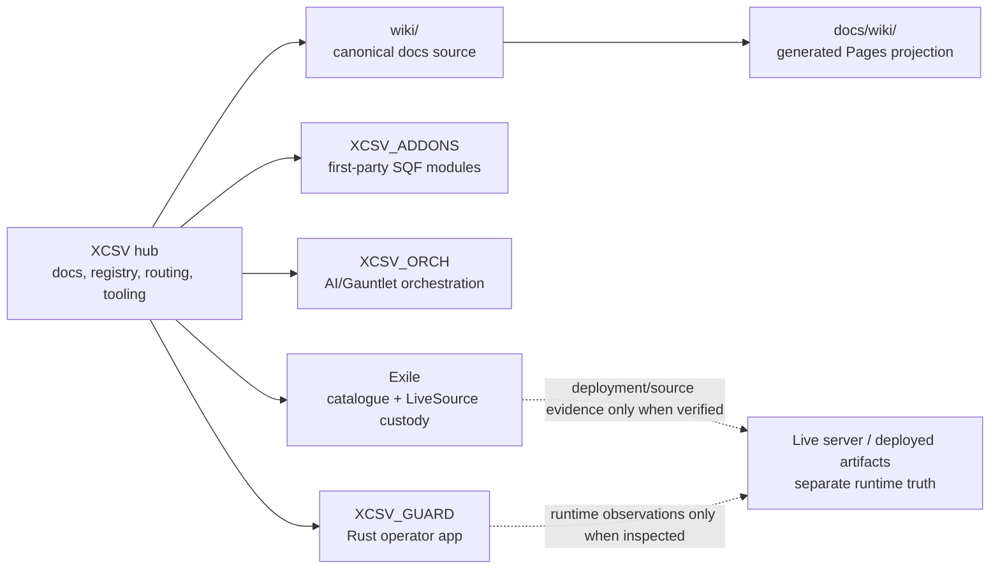

# XCSV

**XCSV is the project hub for an Arma 3 Exile server estate: documentation, repository routing, source-observation records, shared tooling, and the map that tells humans and AIs where authority actually lives.**

[](https://github.com/x-cessive/XCSV)
[](https://x-cessive.github.io/XCSV/)
[](wiki/System-Components.md)
[](registry/current-state.json)

## AI / AGENT START HERE

If you are an AI agent, start at [AI-START-HERE.md](AI-START-HERE.md) before interpreting roadmap state, creating commits, or mutating any repository.

That file routes to the canonical AI contract, repository identity manifest, freshness model, documentation source rules, and completion obligations. Do not infer live server/runtime truth from this README.

## What XCSV Owns

XCSV is canonical for:

- project-hub navigation and repository-family routing;
- Git-tracked wiki source in `wiki/` and generated Pages projection in `docs/wiki/`;
- AI bootstrap, provenance, documentation-sync, and cold-rehydration contracts;
- shared hub tooling, memory/RAG tooling, and member-repository pointers;
- the evidence-backed component registry at [registry/components.json](registry/components.json).

XCSV is not canonical for:

- XCSV GUARD Rust application source;
- XCSV first-party addon/module source;
- XCSV orchestration implementation source;
- third-party Exile catalogue source;
- live server health, deployed PBOs, live DB state, BattlEye state, RPT boot evidence, or player-runtime behavior unless those sources are explicitly reverified.

Repository identity is machine-readable in [registry/repository-identity.json](registry/repository-identity.json).

## Source-Observation Posture

Stored observations are not standing currentness. [registry/current-state.json](registry/current-state.json) records what was observed, when, and with what evidence. Consumers derive `CURRENT`, `STALE`, `UNKNOWN`, or `NOT_REVERIFIED` by comparing recorded identity to the live source at read time.

The source inventory is accepted as `PARTIAL_INVENTORY / PARTIAL_SOURCE_VERIFIED`. Read current component counts and source-wiring evidence from [System Components](wiki/System-Components.md) and [registry/components.json](registry/components.json), not from front-door prose. Runtime/deployment/live DB/live BattlEye/RPT/player behavior remains `NOT_REVERIFIED` unless separately inspected.

## Architecture At A Glance



The hub routes work to the owning repository. It does not absorb implementation authority from member repositories.

## Repository Family

| repository | role | XCSV relationship |
|---|---|---|
| [x-cessive/XCSV](https://github.com/x-cessive/XCSV) | public project hub | this repository |
| [x-cessive/XCSV_GUARD](https://github.com/x-cessive/XCSV_GUARD) | native Rust/egui operations console | member repo, private source authority |
| [x-cessive/XCSV_ADDONS](https://github.com/x-cessive/XCSV_ADDONS) | first-party XCSV addons and mission modules | member repo, private source authority |
| [x-cessive/XCSV_ORCH](https://github.com/x-cessive/XCSV_ORCH) | XCSV-specific AI/Gauntlet orchestration | member repo, private source authority |
| [x-cessive/Exile](https://github.com/x-cessive/Exile) | third-party catalogue plus separated LiveSource custody | member repo, public source/catalogue authority |

See [Repositories](wiki/Repositories.md) for boundaries, local path notes, and routing rules.

## Major System Capabilities

- Arma 3 Exile Tanoa mission and server estate documentation.
- Component registry for addons, scripts, server addons, tools, database/query surfaces, and source-wiring evidence.
- GUARD operator-console programme covering supervision, integrity, RCon, logs, metrics, DB views, releases, and future evidence workflows.
- First-party XM8 apps and mission modules, tracked by source evidence rather than README assertions.
- Drone and counter-UAS roadmap surface, currently source-inventory/documentation oriented rather than runtime-verified.
- Custom map/editing pipeline documentation for Eden/static-object work without creating a second map authority.
- AI provenance, documentation sync, cold-rehydration, and completion-impact contracts.

## Documentation Navigation

| need | start here |
|---|---|
| AI bootstrap | [AI-START-HERE.md](AI-START-HERE.md) |
| human overview | [wiki/Home.md](wiki/Home.md) |
| source/runtime boundaries | [Architecture](wiki/Architecture.md) |
| component truth | [System Components](wiki/System-Components.md) |
| repository routing | [Repositories](wiki/Repositories.md) |
| operations and recovery | [Runbook](wiki/Runbook.md) |
| GUARD programme | [GUARD Development Plan](wiki/XCSV-GUARD-Development-Plan.md) |
| XM8 apps | [XM8 Apps](wiki/XM8-Apps.md) |
| map pipeline | [Custom Map Editing](wiki/Custom-Map-Editing.md) |
| drone/counter-UAS | [Drone & Counter-UAS](wiki/Drone-and-Counter-UAS.md) |
| evidence/freshness | [Repository Identity & Freshness](wiki/Repository-Identity-and-Freshness.md) |

## Development And Operator Entrypoints

```powershell
# Generate Pages projection from canonical wiki source
.\tools\build-docs.ps1

# Build local memory index after canonical docs change
.\tools\build-memory-index.ps1 -WikiDir .\wiki -OutFile .\wiki\Memory-Index.md

# Build local RAG index when policy requires it
.\tools\build-rag-index.ps1

# Publish GitHub Wiki from wiki/ only, after review/authority
.\tools\push-wiki.ps1

# Derive freshness from recorded observations plus live identities
.\tools\current-state.ps1
```

Generated files under `docs/wiki/` are not hand-maintained authority. Edit `wiki/`, then regenerate.

## Governance, Security, And Provenance

- No secrets, credentials, tokens, private runtime state, or local model runtime logs belong in git.
- AI-authored commits require XCSV provenance trailers defined in [AI Provenance & Doc Sync](wiki/AI-Provenance-and-Doc-Sync.md).
- Cross-repository impact must be routed; this hub does not grant member-repository write authority.
- Historical installation notes remain useful evidence, but they must be labeled as historical unless reverified.
- `UNKNOWN` is a valid state. It must not be rewritten as healthy, live, deployed, or absent.

## Status Boundary

The source inventory is good enough to support documentation modernization. It is not live-runtime acceptance. Issue #30 remains open for deployed artifacts, loaded mod/servermod command line, RPT/boot, live DB, live BattlEye, player-runtime behavior, and unresolved runtime authority for overlapping systems.
