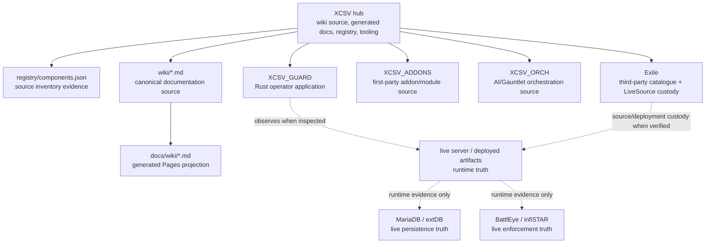
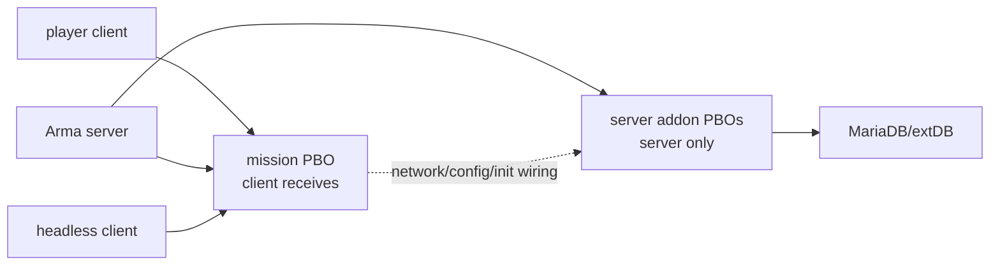
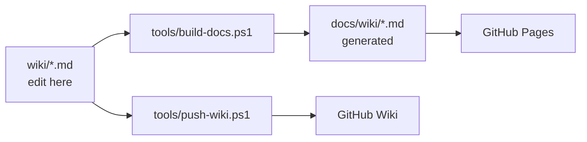

<!-- GENERATED FROM wiki/Architecture.md BY tools/build-docs.ps1. DO NOT EDIT docs/wiki BY HAND. -->

XCSV architecture is an ownership and evidence map. It distinguishes canonical source, generated documentation, deployment mirrors, runtime observations, and historical evidence so a human or AI can route work without turning prose into authority.

## Ownership Topology

Solid arrows show repository-family routing and documentation generation. Dotted arrows require fresh evidence before making current claims.

## Evidence Classes

| class | meaning |
|---|---|
| canonical source | owned source in the repository responsible for that component |
| generated documentation | deterministic projection from `wiki/`, not hand-maintained authority |
| deployment mirror | filesystem or packaged copy that may match source only when hash/drift evidence proves it |
| runtime evidence | process, RPT, DB, BattlEye, GUARD, player, or deployed-artifact evidence inspected at a specific time |
| historical evidence | useful record of past install/repair/verification; not current unless reverified |

The component registry is source-inventory truth, not live-runtime truth. Issue #30 accepted `PARTIAL_INVENTORY / PARTIAL_SOURCE_VERIFIED`; it did not grant deployed/runtime acceptance.

## Runtime Shape To Reverify

The documented operating estate includes:

| surface | documented role | currentness rule |
|---|---|---|
| `arma3server_x64.exe` | Arma 3 dedicated server process | inspect runtime/process/RPT before claiming current |
| MariaDB + extDB3 | persistence bridge | inspect live DB/extDB logs before claiming current |
| headless client | AI/mission offload process | inspect launch state/RPT before claiming current |
| `XCSV_GUARD.exe` | operator console and evidence instrument | inspect GUARD source/runtime separately |
| BattlEye + infiSTAR | enforcement/logging surfaces | inspect live filters/logs before claiming current |

These are documented architecture surfaces. They are not automatically live merely because they appear here.

## Content Layers

Mission-side UI, XM8 apps, client bootstrap, and client-visible resources belong in mission custody. Server-only handlers, persistence, and server modules belong in server-addon/source custody. Exact current deployment must be verified from packed artifacts and runtime evidence.

## Critical Integration Seams

| seam | why it matters |
|---|---|
| `CfgExileCustomCode` | exactly one override path wins for each Exile function; duplicate vendor installs can silently replace work |
| `CfgNetworkMessages` | client/server message names and handlers must resolve as pairs |
| init/bootstrap files | `init.sqf`, `initServer.sqf`, `initPlayerLocal.sqf`, preInit/postInit and HC startup determine load order/locality |
| database/query config | source `.sql`/extDB/query files are not proof of live DB deployment |
| BattlEye filters | source exceptions are not proof of live enforcement or allow-list state |
| XCSV_ADDONS <-> LiveSource mirrors | mirrored copies require custody and drift evidence, not two hand-maintained truths |

## Local Model Trust Boundary

XCSV design treats local model output as untrusted data. A model may help classify logs or produce explanations, but it must not become execution authority.

Durable invariants:

- model output is text to review, not a decision;
- model output must not directly start/stop services, mutate files, issue RCon actions, change the database, or deploy artifacts;
- players must not be able to reach or influence the local-model path;
- request handling must avoid unsafe command-line interpolation, such as passing prompt text through shell arguments;
- system operation must not depend on model availability.

These are architectural/security constraints, not evidence that a specific local model server is currently running.

## Override Collision Rule

`CfgExileCustomCode` is the sanctioned Exile override seam. Exile functions are repointed by configuration; the upstream PBOs should remain unmodified unless a separately authorized vendor/source action says otherwise.

Exactly one override path wins for each Exile function. When multiple systems need the same Exile function, their behavior must be deliberately reconciled into one active replacement. Duplicate override ownership is a material integration risk because the last registration can silently hide another feature.

The historical Scavenge collision is preserved in [Lessons](Lessons.html). The current actionable rule is: never install or refactor an addon that touches `CfgExileCustomCode` without checking the existing override registry/source evidence first.

## Historical Runtime Notes

Historical runtime facts are useful failure evidence, but they are not current Architecture truth. Preserved examples include the x86/extDB2 failure class, historical BattlEye enforcement staging, and infiSTAR cloud-reporting failures. Treat those as dated lessons and reverify live runtime/security state before acting.

## Threading Constraint

Arma server simulation is effectively single-threaded for mission SQF scheduling. More CPU cores do not make every addon cheap. Headless clients can move selected AI/mission load to a separate process, but runtime benefit must be measured, not inferred.

Design consequences:

- prefer bounded scheduler ownership over private endless loops;
- keep duplicate AI/event systems explicit until runtime authority is proven;
- measure object count, scheduler load, RPT growth, and headroom before adding systems;
- keep `UNKNOWN` visible when runtime evidence is missing.

## Documentation Flow

Do not edit `docs/wiki/` as source authority. Rebuild it from `wiki/` and compare drift.

## Related

- [System Components](System-Components.html)
- [Repositories](Repositories.html)
- [Runbook](Runbook.html)
- [Repository Identity & Freshness](Repository-Identity-and-Freshness.html)
