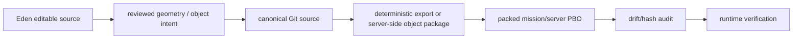

# Custom Map Editing

Custom map work changes what players and the server simulate. Treat it as source custody plus deployment evidence, not as a loose collection of Eden exports.

## Authority Boundary

| surface | role | currentness rule |
|---|---|---|
| `x-cessive/Exile` LiveSource | separated mission/source custody where current source evidence is expected |
| `mission.sqm` | Eden-editable mission world state | source presence is not deployed proof |
| server-side object scripts | optional deterministic object spawning | verify init/include path and packed artifact |
| editor/export tooling | build aid | does not prove runtime deployment |
| live server PBO | deployed artifact | requires hash/path/runtime evidence |

The XCSV hub documents the pipeline. It does not become the map source authority for member repositories.

## Target Pipeline

Every transition should leave evidence. A screenshot of an Eden scene or an old install note is not enough to claim current deployment.

## Known Inventory Surfaces

Issue #30 source inventory covers map/static-object candidates in the component registry, including mission modules, scripts, catalogue references, and tooling. Use [System Components](System-Components) for the current source-evidence view.

Important families to reconcile in later lanes:

- `mission.sqm`
- `initServer.sqf` static-object patterns
- server-side object catalogue material
- Eden/3DEN helper tooling
- building replacement/static object systems
- Prison Project / graybox work

## Rules For Future Map Work

- Do not create a second hand-maintained map-object architecture.
- Preserve historical install/export notes until unique knowledge is migrated into the right authority.
- Separate editor source, generated export, packed artifact, and deployed runtime evidence.
- Require drift/hash checks before claiming deployment equivalence.
- Treat destructive geometry or object changes as high risk until runtime evidence exists.

## Related

- [Architecture](Architecture)
- [System Components](System-Components)
- [Repositories](Repositories)
- [Runbook](Runbook)
